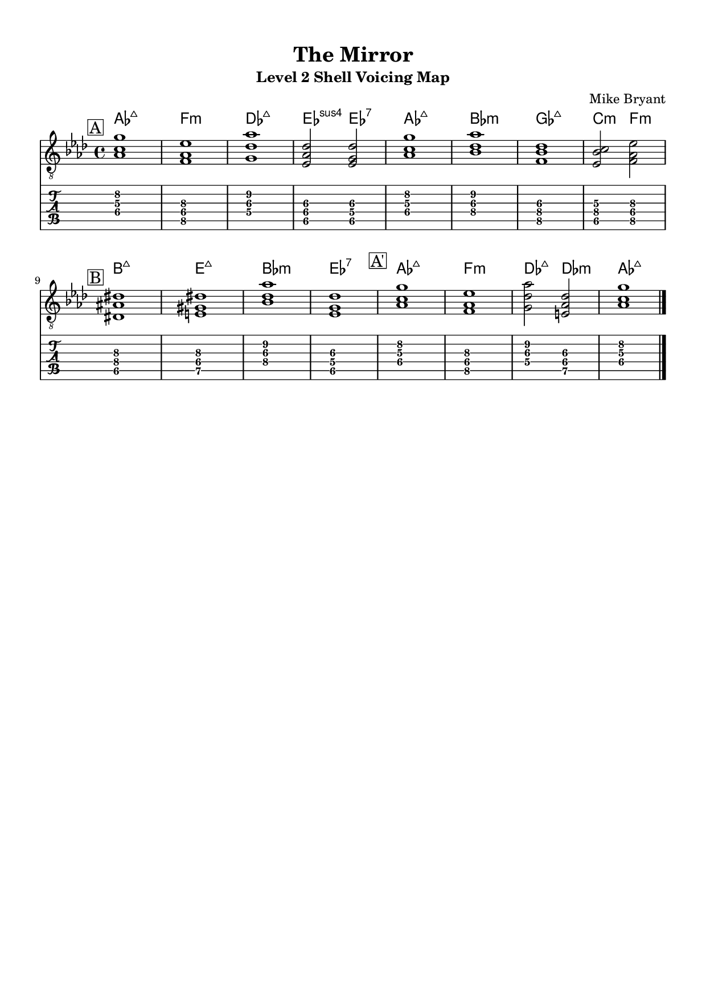
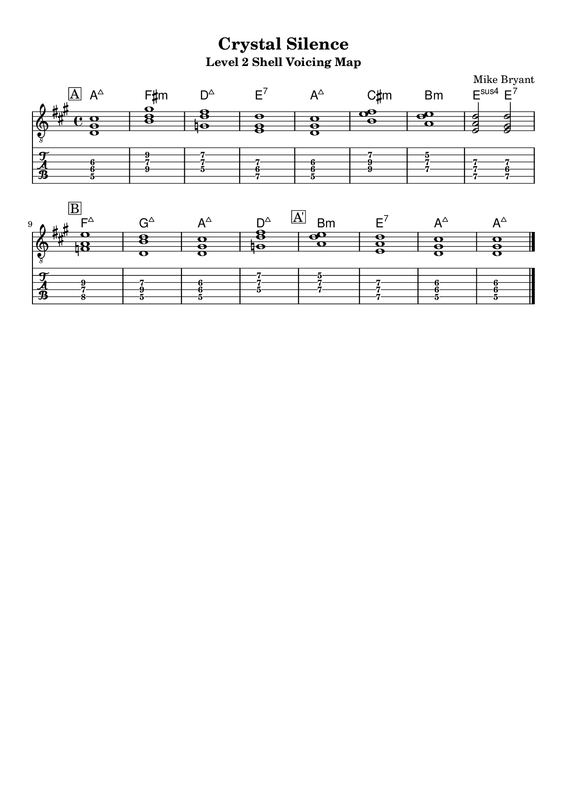
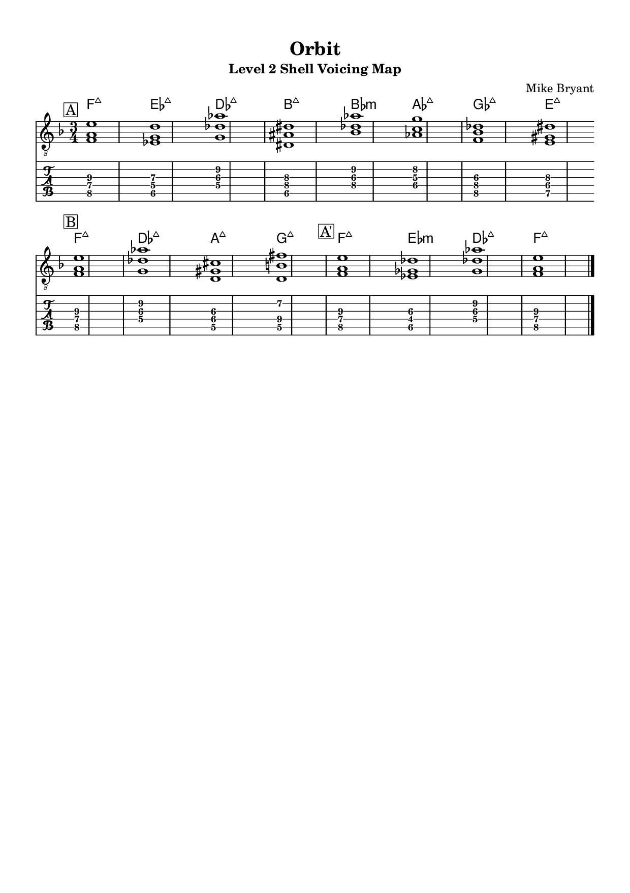
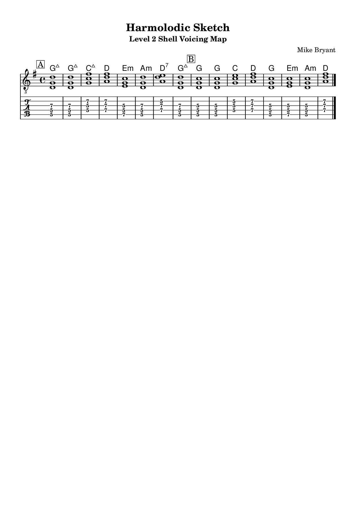
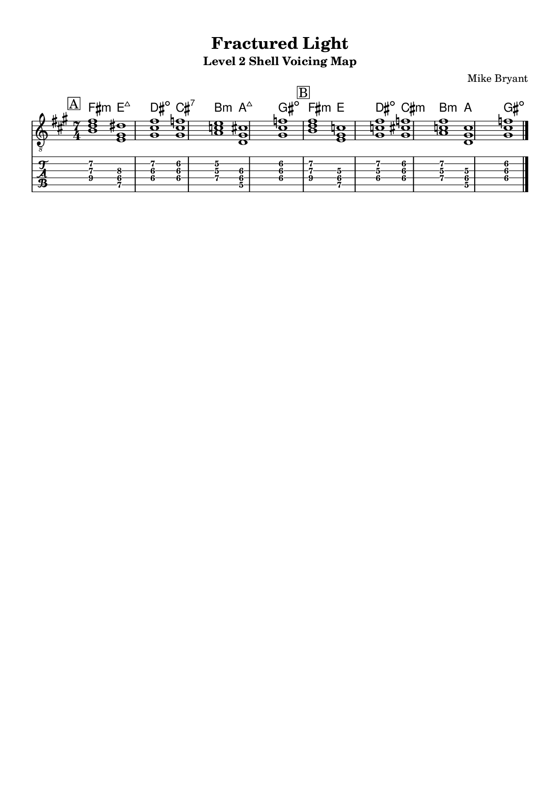

# PARALLAX
## Modern Jazz Guitar Trio Studies

---

<div align="center">

**━━━━━━━━━━━━━━━━━━━━━━━━━━━━━━━━━━━━━━━━━━━━━━━━━━━━**

### Original Compositions for Jazz Guitar Trio

**━━━━━━━━━━━━━━━━━━━━━━━━━━━━━━━━━━━━━━━━━━━━━━━━━━━━**

<br>

*The GCE Jazz Collection*

<br>

# P A R A L L A X

### Modern Jazz Guitar Trio Studies

<br>

---

*A collection of original compositions in the styles of*

**Jim Hall • Chick Corea • Wayne Shorter • John Scofield**  
**Pat Metheny • Pat Martino • Bill Frisell • Ant Law • Grant Green**

---

<br>

**Guitar • Bass • Drums**

*Lead Sheets with Harmonic Analysis & Practice Studies*

<br>

---

**Composed & Arranged by**

## Mike Bryant

<br>

---

| | |
|:---|---:|
| **GCE JAZZ** | **© 2025 Mike Bryant** |
| *Grand Criteria of Excellence* | *All Rights Reserved* |
| | *International Copyright Secured* |

<br>

**Version 5.2 (Corrected) — December 2025**

**PRINT-FINAL**

**━━━━━━━━━━━━━━━━━━━━━━━━━━━━━━━━━━━━━━━━━━━━━━━━━━━━**

</div>

---

<div style="page-break-after: always;"></div>

# MASTER TABLE OF CONTENTS

## Front Matter
- [V5 ChangeLog (From V4)](#v5-changelog-from-v4)
- [V5 Consistency Matrix](#v5-consistency-matrix-source-of-truth)
- [How to Use This Book (3 Modes)](#how-to-use-this-book-3-modes)
  - [Mode 1: Gig Ready](#mode-1-gig-ready-fast-path)
  - [Mode 2: Vocabulary Builder](#mode-2-vocabulary-builder)
  - [Mode 3: Composition Study](#mode-3-composition-study)
- [Preface](#preface)
- [Introduction](#introduction)

## The Eleven Tunes

### Tier 1: Concert Core
| Ch | Tune | Style | Jump To |
|:--:|:-----|:------|:--------|
| 1 | [The Mirror](#chapter-1-the-mirror) | Jim Hall | [MVG](#minimum-viable-gig-mvg) · [Form](#the-form) · [Scales](#scale-palette) · [Voicings](#voicing-reference) |
| 2 | [Crystal Silence](#chapter-2-crystal-silence) | Chick Corea | [MVG](#minimum-viable-gig-mvg-1) · [Form](#the-form-1) · [Scales](#scale-palette-1) · [Voicings](#voicing-reference-1) |
| 3 | [Orbit](#chapter-3-orbit) | Wayne Shorter | [MVG](#minimum-viable-gig-mvg-2) · [Form](#the-form-2) · [Scales](#scale-palette-2) · [Voicings](#voicing-reference-2) |

### Tier 2: Core Performance
| Ch | Tune | Style | Jump To |
|:--:|:-----|:------|:--------|
| 4 | [Parallax](#chapter-4-parallax) | John Scofield | [MVG](#minimum-viable-gig-mvg-3) · [Form](#the-form-3) · [Scales](#scale-palette-3) · [Voicings](#voicing-reference-3) |
| 5 | [First Light](#chapter-5-first-light) | Pat Metheny | [MVG](#minimum-viable-gig-mvg-4) |
| 6 | [Angular Motion](#chapter-6-angular-motion) | Pat Martino | [MVG](#minimum-viable-gig-mvg-5) |

### Tier 3: Modern Extensions
| Ch | Tune | Style | Jump To |
|:--:|:-----|:------|:--------|
| 7 | [Blue Cycle](#chapter-7-blue-cycle) | Rosenwinkel/Monder | [MVG](#minimum-viable-gig-mvg-6) |
| 8 | [Harmolodic Sketch](#chapter-8-harmolodic-sketch) | Bill Frisell | [MVG](#minimum-viable-gig-mvg-7) |
| 9 | [Entangled Horizons](#chapter-9-entangled-horizons) | Ant Law | [MVG](#minimum-viable-gig-mvg-8) |
| 10 | [Fractured Light](#chapter-10-fractured-light) | Ant Law (7/4) | [MVG](#minimum-viable-gig-mvg-9) |

### Tier 4: Groove Anchor
| Ch | Tune | Style | Jump To |
|:--:|:-----|:------|:--------|
| 11 | [Greezy](#chapter-11-greezy) | Grant Green | [MVG](#minimum-viable-gig-mvg-10) |

## Level 3 — Harmonic Navigation Summaries
- [Level 3: The Mirror](#level-3-the-mirror)
- [Level 3: Crystal Silence](#level-3-crystal-silence)
- [Level 3: Orbit](#level-3-orbit)
- [Level 3: Parallax](#level-3-parallax)
- [Level 3: First Light](#level-3-first-light)
- [Level 3: Angular Motion](#level-3-angular-motion)
- [Level 3: Blue Cycle](#level-3-blue-cycle)
- [Level 3: Harmolodic Sketch](#level-3-harmolodic-sketch)
- [Level 3: Entangled Horizons](#level-3-entangled-horizons)
- [Level 3: Fractured Light](#level-3-fractured-light)
- [Level 3: Greezy](#level-3-greezy)

## Back Matter
- [Glossary](#glossary)
- [About the Author](#about-the-author)

---

<div style="page-break-after: always;"></div>

# V5 CHANGELOG (FROM V4) {#v5-changelog-from-v4}

This section documents all changes made in the V5 upgrade.

## Trust Pass Fixes

- **Fixed style tag mismatch in Chapter 1**: Changed "Scofield Ballad" to "Jim Hall Style" (per TOC)
- **Fixed style tag mismatch in Chapter 2**: Changed "ECM Ballad" to "Chick Corea Style" (per TOC)
- **Fixed style tag mismatch in Chapter 6**: Changed "Bebop/Etude" to "Pat Martino Style" (per TOC)
- **Fixed style tag mismatch in Chapter 7**: Changed "Blues (Cycle)" to "Rosenwinkel/Monder Style" (per TOC)
- **Fixed style tag mismatch in Chapter 11**: Changed "Blues Shuffle" to "Grant Green Style" (per TOC)
- **Fixed all navigation links**: Updated Previous/Next links to match V4 TOC order
- **Standardized footer text**: All chapters now use "GCE Jazz - Trio Tunes Method Book V5 © 2025 Mike Bryant"
- **Removed broken file path references**: Eliminated all `file:///C:/Users/...` strings

## Accessibility Pass Additions

- Added **"How to Use This Book (3 Modes)"** section
- Added **Minimum Viable Gig (MVG)** box to every chapter
- Added **Prerequisites** subsection to every chapter
- Added **If You Get Stuck** subsection to every chapter
- Added **Glossary** at end of book
- Added **V5 Consistency Matrix** as source of truth

## Layout Pass Improvements

- Standardized all heading levels (H1 Book Title, H2 Chapter, H3 Section, H4 Subsection)
- Ensured all tables wrap text properly within cells
- Improved visual hierarchy with consistent spacing
- Converted dense text blocks to bullet lists where appropriate

## V5.1 Additions

- Added formatted **Title Page** matching V4 style
- Added **Master Table of Contents** with hyperlinks to all chapters and key sections
- All chapter headings and key subheadings now linkable via anchor IDs

## V5.2 Additions (Print-Final)

- **Redesigned cover page** (minimalist, print-ready)
- **Added "How the Three Levels Work Together"** master diagram (text-based, print-safe)
- **Added Level 3 conceptual summaries** for all 11 tunes (one page each, no notation)
- **Expanded "About the Author"** with full biography and author photo
- **All Level 1 and Level 2 content unchanged** (locked from V5.1)
- **V5.2 is considered PRINT-FINAL**

## V5.2 (Corrected) Fixes

- **ADDED Level 2 Shell Voicing PNG maps** for all 11 tunes (visual fretboard maps, not text)
- **EMBEDDED author photo** in About the Author section
- **REMOVED all file:/// path artifacts** from footers and headers
- **Version locked and labelled**: Parallax_MethodBook_V5.2 (Corrected)

---

<div style="page-break-after: always;"></div>

# V5 CONSISTENCY MATRIX (SOURCE OF TRUTH) {#v5-consistency-matrix-source-of-truth}

| Chapter # | Tune Title | Style Tag | Key Center | Time Signature | Tempo | Form |
|:---------:|:-----------|:----------|:-----------|:--------------:|:------|:-----|
| 1 | The Mirror | Jim Hall Style | Ab Major | 4/4 | 60 BPM | 16-bar AABA |
| 2 | Crystal Silence | Chick Corea Style | A Major | 4/4 | 80 BPM | 16-bar |
| 3 | Orbit | Wayne Shorter Style | F Major | 3/4 | 160 BPM | 16-bar |
| 4 | Parallax | John Scofield Style | Bb Dominant | 4/4 | 108 BPM | 32-bar |
| 5 | First Light | Pat Metheny Style | G Major | 4/4 | 96 BPM | 32-bar |
| 6 | Angular Motion | Pat Martino Style | Gb Major | 4/4 | 200 BPM | 32-bar AABA |
| 7 | Blue Cycle | Rosenwinkel/Monder Style | Bb Major | 4/4 | 120 BPM | 12-bar blues |
| 8 | Harmolodic Sketch | Bill Frisell Style | G Major | 4/4 | 88 BPM | 32-bar |
| 9 | Entangled Horizons | Ant Law Style | E Minor | 4/4 | 120 BPM | 32-bar |
| 10 | Fractured Light | Ant Law Style (7/4) | F# Minor | 7/4 | 140 BPM | 28-bar |
| 11 | Greezy | Grant Green Style | G Major | 12/8 | 100 BPM | 12-bar blues |

### Notes on V4 to V5 Fixes

- **Chapter 1 (The Mirror)**: V4 header said "Scofield Ballad" — corrected to "Jim Hall Style" per TOC
- **Chapter 2 (Crystal Silence)**: V4 header said "ECM Ballad" — corrected to "Chick Corea Style" per TOC
- **Chapter 6 (Angular Motion)**: V4 header said "Bebop/Etude" — corrected to "Pat Martino Style" per TOC
- **Chapter 7 (Blue Cycle)**: V4 header said "Blues (Cycle)" — corrected to "Rosenwinkel/Monder Style" per TOC
- **Chapter 11 (Greezy)**: V4 header said "Blues Shuffle" — corrected to "Grant Green Style" per TOC

---

<div style="page-break-after: always;"></div>

# HOW TO USE THIS BOOK (3 MODES) {#how-to-use-this-book-3-modes}

This book supports three distinct practice modes. Choose based on your goals and available time.

---

## Mode 1: GIG READY (Fast Path) {#mode-1-gig-ready-fast-path}

**Goal**: Get performance-ready on 3 tunes quickly

**What to practice first**:
1. Learn the head (melody) from Version A of each chapter
2. Master the basic chord voicings from the Voicing Reference section
3. Work through the 4-week Practice Routine at accelerated pace

**Time options**:

| Available Time | What to Do |
|:---------------|:-----------|
| 15 minutes | One tune: Head only, with metronome. Memorize form. |
| 30 minutes | One tune: Head + shell voicings. Comp through form. |
| 60 minutes | One tune: Head + Version A solo + basic comping pattern. |

**What to skip when short on time**:
- Skip Triad Pair Vocabulary until you're comfortable with the head
- Skip Versions B and C initially
- Skip the "Technique Focus" section until gig is done

**Recommended 3-tune gig set**: The Mirror (ballad), Parallax (groove), Greezy (blues)

---

## Mode 2: VOCABULARY BUILDER {#mode-2-vocabulary-builder}

**Goal**: Systematically expand your jazz vocabulary across styles

**What to practice first**:
1. Start with the Scale Palette for each chapter — internalize the sounds
2. Work through Triad Pair Vocabulary exercises daily
3. Progress through all Three Choruses (A → B → C) for each tune

**Time options**:

| Available Time | What to Do |
|:---------------|:-----------|
| 15 minutes | One section: Drill one triad pair over one chord. |
| 30 minutes | One chapter: Scale palette + triad pairs over full form. |
| 60 minutes | One chapter: All three choruses at slow tempo with analysis. |

**What to skip when short on time**:
- Skip Voicing Reference until vocabulary is solid
- Skip Listening Recommendations for focused practice sessions
- Save Technique Focus for dedicated technical practice days

**Recommended sequence**: Work Chapters 1-6 in order over 6 weeks, then 7-11

---

## Mode 3: COMPOSITION STUDY {#mode-3-composition-study}

**Goal**: Understand how to compose in these styles

**What to practice first**:
1. Analyze the Form section — understand the harmonic logic
2. Study the Key Harmonic Features in each chapter
3. Compare the Three Choruses to see compositional development

**Time options**:

| Available Time | What to Do |
|:---------------|:-----------|
| 15 minutes | One chapter: Read Overview and Key Harmonic Features only. |
| 30 minutes | One chapter: Analyze form + compare to Listening Recommendations. |
| 60 minutes | One chapter: Full harmonic analysis, write your own variation. |

**What to skip when short on time**:
- Skip Practice Routine (you're analyzing, not performing)
- Skip Technique Focus sections
- Skip Self-Evaluation checklists

**Recommended approach**: Listen to original artists first, then analyze the chapter

---

<div style="page-break-after: always;"></div>

# HOW THE THREE LEVELS WORK TOGETHER {#how-the-three-levels-work-together}

*A Master Diagram*

```
┌─────────────────────────────────────────────────────────────────┐
│                      LEVEL 3                                    │
│              Harmonic Navigation & Voice-Leading                │
│    ┌─────────────────────────────────────────────────────┐     │
│    │  • Harmonic gravity (where is the music going?)     │     │
│    │  • Voice-leading intent (what moves, what stays?)   │     │
│    │  • Structural awareness (A / B / A' behaviour)      │     │
│    │  • Continuity across the form                       │     │
│    └─────────────────────────────────────────────────────┘     │
│                          ▲ REQUIRES                             │
├──────────────────────────┼──────────────────────────────────────┤
│                      LEVEL 2                                    │
│               Physical Clarity & Shell Voicings                 │
│    ┌─────────────────────────────────────────────────────┐     │
│    │  • Root-3rd-7th voicings (7th position)             │     │
│    │  • Visual pattern recognition on the fretboard      │     │
│    │  • Muscle memory for chord function                 │     │
│    │  • Physical economy (minimal hand movement)         │     │
│    └─────────────────────────────────────────────────────┘     │
│                          ▲ REQUIRES                             │
├──────────────────────────┼──────────────────────────────────────┤
│                      LEVEL 1                                    │
│               Harmonic Vocabulary                               │
│    ┌─────────────────────────────────────────────────────┐     │
│    │  • Full chord symbols and extensions                │     │
│    │  • Scale palette for each chord                     │     │
│    │  • Multiple voicing options                         │     │
│    │  • Intellectual understanding of the harmony        │     │
│    └─────────────────────────────────────────────────────┘     │
└─────────────────────────────────────────────────────────────────┘
```

## What Each Level Gives You

| Level | Focus | Output | Time Investment |
|:------|:------|:-------|:----------------|
| 1 | Harmonic vocabulary | You can *describe* the harmony | 2-4 weeks per tune |
| 2 | Physical clarity | You can *find* the harmony instantly | 1-2 weeks per tune |
| 3 | Harmonic navigation | You can *move through* the harmony | Ongoing |

## The Key Insight

- Level 1 without Level 2 is theory without physicality.
- Level 2 without Level 1 is mechanics without understanding.
- Level 3 without both is abstraction without substance.

**All three levels work together. The goal is integration.**

---

<div style="page-break-after: always;"></div>

# PREFACE {#preface}

*"The goal isn't to play jazz—it's to speak through it."*

## Why This Book Exists

In December 2025, I found myself preparing for a series of informal sessions with musician friends across North London—guitarists, bassists, drummers, and the occasional horn player dropping by. We needed material that was genuinely playable, harmonically interesting, and suited to the guitar trio format. What we didn't need was another collection of transcriptions or standards arrangements.

So I composed these pieces myself.

Each tune in this book is an original composition written in the style of a jazz guitar master—from Jim Hall's reflective lyricism to Ant Law's rhythmic complexity. They're designed not as tributes or imitations, but as vehicles: functional pieces that let you explore specific harmonic, melodic, and rhythmic concepts while building real repertoire you can perform.

This isn't an exercise book disguised as music. These are real tunes. They have form, narrative, and emotional arc. The educational material surrounding each piece exists to help you internalize the language so thoroughly that when you play, you're not thinking about theory—you're making music with friends.

---

## The Core Philosophy

Three principles guide this method:

**1. Style as Vocabulary.** Each chapter immerses you in a specific guitarist's harmonic and melodic language. By learning to "speak" in Jim Hall's voice, then Pat Metheny's, then John Scofield's, you develop range. Over time, these voices blend into your own.

**2. Trio Thinking.** The guitar trio is a unique format. You're simultaneously the harmonic foundation, melodic voice, and textural colorist. Every tune in this book is conceived for this reality—with space for the bass to walk or lock in, the drums to breathe or push, and the guitar to lead without dominating.

**3. Performance-Ready.** Each piece is designed to be gigged. They have clear heads, logical solo sections, and satisfying endings. The goal of your practice is always the same: play these tunes with other musicians, in front of other people, as soon as you're ready.

---

## The Eleven Tunes

The compositions are arranged by quality and impact—the strongest pieces first. Here's what each explores:

**1. The Mirror** (Jim Hall Style) — Reflective, unhurried harmony. Teaches patience, voice-leading, and the power of space. The quietest tune in the book, and often the most powerful in performance.

**2. Crystal Silence** (Chick Corea Style) — Luminous major 9th chords, ECM-style clarity. Explores quartal voicings, modal ambiguity, and lyrical phrasing across long arcs.

**3. Orbit** (Wayne Shorter Style) — Elliptical harmony, unexpected resolutions. This is mystery and propulsion combined—Shorter's gift for making the strange feel inevitable.

**4. Parallax** (John Scofield Style) — Angular lines over funk elasticity. Blues chromaticism meets modern sophistication. The rhythm section will love this one.

**5. First Light** (Pat Metheny Style) — Open-sky lyricism, arpeggiated figures that shimmer. Teaches breathing, dynamics, and the Lydian palette.

**6. Angular Motion** (Pat Martino Style) — Linear intensity, fretboard logic at speed. A workout for technique that never sacrifices musicality.

**7. Blue Cycle** (Rosenwinkel/Monder Style) — Modern blues abstraction. Reharmonization without losing the form. For jazz-savvy listeners who lean in.

**8. Harmolodic Sketch** (Bill Frisell Style) — Textural, spacious, Americana-inflected. Open triads that ring like bells. The art of understatement.

**9. Entangled Horizons** (Ant Law Style) — Rhythmic displacement, modern extensions. Complex on paper, natural in practice. Teaches precision that sounds effortless.

**10. Fractured Light** (Ant Law Style, 7/4) — 7/4 meter, refracted through a prism. Seven beats, one unified groove. For when you're ready to leave 4/4 behind.

**11. Greezy** (Grant Green Style) — Soul-jazz simplicity, pocket and blues vocabulary. The anchor tune—fun, immediate, and always welcome at a session.

---

## What Each Chapter Contains

Every chapter follows the same structure, designed to take you from first encounter to performance-ready:

### Overview
Context for the style, the concept behind the tune, and what you'll learn. Read this first to orient yourself.

### Minimum Viable Gig (MVG)
What you need to play this tune at a session tonight. Ready-Set checklist, tempo milestones, and fallback routes.

### Prerequisites
Skills and knowledge you should have before tackling this chapter.

### If You Get Stuck
Pointers to specific sections that will help when you hit a wall.

### The Form
Complete chord charts with section breakdowns. This is your roadmap—memorize it early.

### Scale Palette
Scale choices for each chord, with color tones highlighted. Not prescriptive rules, but proven options.

### Triad Pair Vocabulary
Modern linear approach using paired triads. This is how contemporary players generate melodic material without running scales.

### The Three Choruses
Three versions of increasing complexity:
- **Version A** — Lyrical, melody-focused, space to breathe
- **Version B** — Triad-based, more motion, developing fluency
- **Version C** — Chord melody, full voicings, performance-ready

### Voicing Reference
Practical chord shapes you'll actually use. Fingerings, positions, voice-leading connections.

### Technique Focus
Style-specific techniques unique to each chapter—volume swells for Frisell, hybrid picking for Ant Law, arpeggiated phrasing for Metheny.

### Practice Routine
A four-week structured approach. Week by week, you build the components, then integrate them.

### Listening Recommendations
Essential recordings to study. These are your real teachers—I'm just pointing the way.

### Self-Evaluation
Checklist for mastery. Be honest with yourself. If you can answer "yes" to every question, you're ready to perform.

---

## A Final Word

The best jazz I've ever played happened in living rooms and rehearsal spaces, with friends who were willing to take risks and listen hard. That's who this book is for—musicians who want to grow, who aren't afraid of complexity, but who never forget that the point is connection.

I hope these tunes serve you as well as they've served me. Learn them, adapt them, make them your own. And when you play them with your own musician friends, somewhere in your own corner of the world, I hope they sound like yours.

*Mike Bryant*
*North London, December 2025*

---

<div style="page-break-after: always;"></div>

# INTRODUCTION {#introduction}

## Welcome

This method book presents 11 original compositions in the style of jazz guitar masters, designed for the guitar trio format (guitar, bass, drums). Each chapter provides comprehensive study material including harmonic analysis, scale palettes, triad pair vocabulary, chord voicings, and structured practice routines.

The songs are ordered by compositional interest, educational value, and performance appeal—placing the strongest material first while building a complete repertoire that spans lyrical, modern, and groove-based styles.

> "This is absolutely 'real music,' not an exercise book in disguise."

---

## Table of Contents

### Tier 1: Concert Core (9.3–9.6)

| Chapter | Title | Style | Score |
|:-------:|:------|:------|:-----:|
| 1 | The Mirror | Jim Hall Style | 9.6 |
| 2 | Crystal Silence | Chick Corea Style | 9.4 |
| 3 | Orbit | Wayne Shorter Style | 9.3 |

### Tier 2: Core Performance Book (8.8–9.2)

| Chapter | Title | Style | Score |
|:-------:|:------|:------|:-----:|
| 4 | Parallax | John Scofield Style | 9.1 |
| 5 | First Light | Pat Metheny Style | 8.9 |
| 6 | Angular Motion | Pat Martino Style | 8.8 |

### Tier 3: Modern Extensions (8.1–8.6)

| Chapter | Title | Style | Score |
|:-------:|:------|:------|:-----:|
| 7 | Blue Cycle | Rosenwinkel/Monder Style | 8.6 |
| 8 | Harmolodic Sketch | Bill Frisell Style | 8.5 |
| 9 | Entangled Horizons | Ant Law Style | 8.3 |
| 10 | Fractured Light | Ant Law Style (7/4) | 8.1 |

### Tier 4: Groove Anchor (8.0)

| Chapter | Title | Style | Score |
|:-------:|:------|:------|:-----:|
| 11 | Greezy | Grant Green Style | 8.0 |

---

## Chapter Structure

Each chapter follows a consistent format:

1. **Overview** — Style context and conceptual introduction
2. **Minimum Viable Gig (MVG)** — Quick-start checklist for performance
3. **Prerequisites** — What you need before starting
4. **If You Get Stuck** — Where to look for help
5. **The Form** — Complete chord charts with section breakdowns
6. **Scale Palette** — Scale choices for each chord
7. **Triad Pair Vocabulary** — Modern linear approach
8. **Three Choruses** — Progressive difficulty (A, B, C versions)
9. **Voicing Reference** — Practical chord shapes
10. **Technique Focus** — Style-specific techniques
11. **Practice Routine** — 4-week structured approach
12. **Listening Recommendations** — Essential recordings
13. **Self-Evaluation** — Mastery checklist

---

## Suggested Study Path

- **Beginners**: Start with Chapters 1, 5, and 11 (The Mirror, First Light, Greezy)
- **Intermediate**: Progress through Chapters 2–6 in order
- **Advanced**: Focus on Chapters 7–10 for modern vocabulary
- **Complete Study**: Work through all 11 chapters over 6–12 months

---

## Practice Philosophy

- Quality over quantity — 20 focused minutes beats 2 distracted hours
- Slow practice builds speed — learn it right, then speed up
- Record yourself weekly — objectivity is essential
- Play with others — trio practice is irreplaceable
- Listen deeply — study the masters referenced in each chapter

---

## The Trio Concept

These compositions are designed specifically for the guitar trio format. Unlike big-band or combo arrangements, the trio places unique demands on the guitarist:

- **Harmonic responsibility** — You're the primary harmonic voice
- **Melodic leadership** — Melody and countermelody are your domain
- **Textural variety** — Single notes, dyads, chords, and everything between
- **Interactive listening** — Space for bass and drums to contribute

### Stylistic Range

The 11 songs span the major stylistic territories of jazz guitar:

| Style | Chapters | Key Focus |
|:------|:---------|:----------|
| Lyrical/ECM | 1, 2, 5, 8 | Melodic phrasing, space, texture |
| Post-Bop | 3, 4, 6 | Harmonic sophistication, linear playing |
| Modern Fusion | 7, 9, 10 | Complex rhythm, extended harmony |
| Soul Jazz | 11 | Groove, blues vocabulary, feel |

---

## About This Edition

Version 5.1 includes:
- Formatted **Title Page** matching V4 style
- **Master Table of Contents** with hyperlinks to all chapters
- Consistency Matrix as source of truth for all tune data
- "How to Use This Book (3 Modes)" for different learning goals
- Minimum Viable Gig (MVG) boxes for every chapter
- Prerequisites and "If You Get Stuck" sections
- Complete Glossary of specialist terms
- Fixed navigation links matching TOC order
- Corrected style tags matching TOC

All songs include corresponding iReal Pro charts, MusicXML files, and Guitar Pro files for practice and performance.

---

> *"The top 6–7 tunes alone justify the book. The full 11 make it future-proof."*

---

<div style="page-break-after: always;"></div>

# CHAPTER 1: THE MIRROR {#chapter-1-the-mirror}

**Style**: Jim Hall Style | **Key**: Ab Major | **Tempo**: 60 BPM | **Time**: 4/4

---

## MINIMUM VIABLE GIG (MVG) {#minimum-viable-gig-mvg}

**Ready-Set Checklist**:
- [ ] Play the head (melody) from memory
- [ ] Comp through the form using shell voicings
- [ ] Play one solo chorus (Version A)
- [ ] Execute the ending (fade on Ab pedal)

**Tempo Milestones**:
- 60% = 36 BPM (learning tempo)
- 80% = 48 BPM (practice tempo)
- 100% = 60 BPM (performance tempo)

**Fallback Route**: If the wide voicings are hard, use shell voicings only (root-3rd-7th). Focus on the melody first; comping can be minimal.

**Micro-goal for today**: Learn bars 1–4 of the melody with proper volume swells.

---

## PREREQUISITES {#prerequisites}

Before tackling this chapter, you should be able to:
- Play major 7th and minor 9th chord voicings in multiple positions
- Understand Lydian mode and its application to major chords
- Execute basic volume swells (using volume knob or pedal)
- Count comfortably at slow tempos (60 BPM quarter notes)
- Read chord charts and navigate 16-bar forms

---

## IF YOU GET STUCK {#if-you-get-stuck}

- **Can't hear the Lydian sound?** → Go to Scale Palette and play each chord with its scale
- **Wide voicings feel awkward?** → Start with Voicing Reference shell shapes first
- **Volume swells aren't smooth?** → See Technique: Volume Swells section
- **Bridge feels disconnected?** → Listen to the Listening Recommendations—hear how masters handle distant keys

---

## OVERVIEW {#overview}

*"Sparse, haunting voicings with wide spreads."*

The Mirror is the emotional center of the Trio Tunes collection. At 60 BPM, every note matters. The "mirror" concept refers to the contrary motion counterpoint in Chorus 3—when one voice ascends, the other descends, creating a reflective, palindromic effect.

**Playing Tip**: Use volume swells; control the decay. Let each note breathe.

---

## THE FORM {#the-form}

16-bar AABA form:

```
A Section (Bars 1-8):
| Abmaj9    | Fm9       | Dbmaj7#11 | Ebsus Eb7 |
| Abmaj9    | Bbm9      | Gbmaj7    | Cm7  Fm7  |

B Section (Bars 9-12):
| Bmaj7#11  | Emaj7     | Bbm7      | Eb7alt    |

A' Section (Bars 13-16):
| Abmaj9    | Fm11      | Dbmaj9 Dbm| Abmaj7/Eb |
```

### Key Harmonic Features

1. **Wide voicings**: Intervals of 9ths, 10ths, and 11ths
2. **Distant relations**: Bmaj7#11 and Emaj7 in the bridge (tritone away from home)
3. **Modal interchange**: Gbmaj7 borrowed from Ab Dorian
4. **Melancholy turn**: Dbmaj9 → Dbm(maj7) in bar 15

---

## SCALE PALETTE {#scale-palette}

| Chord | Primary Scale | Emotional Quality |
|:------|:--------------|:------------------|
| Abmaj9 | Ab Lydian | Open, spacious |
| Fm9 | F Dorian | Melancholy but not dark |
| Dbmaj7#11 | Db Lydian | Floating, dreamlike |
| Gbmaj7 | Gb Lydian | Distant, introspective |
| Bmaj7#11 | B Lydian | Ethereal, otherworldly |
| Emaj7 | E Lydian | Bright but distant |
| Eb7alt | Eb Altered | Tension seeking resolution |
| Dbm(maj7) | Db Melodic Minor | The melancholy turn |

### The Jim Hall Ballad Sound

Jim Hall's ballads feature:
- **Wide intervals** that create space
- **Sustained notes** with volume swells
- **Chromatic voice leading** within slow-moving harmony
- **Silence** as an equal partner to sound

---

## TRIAD PAIR VOCABULARY {#triad-pair-vocabulary}

| Chord | Stable | Color | Spread Effect |
|:------|:-------|:------|:--------------|
| Abmaj9 | Ab Major | Eb Major | 5-7-9 upper structure |
| Fm9 | Ab Major | Eb Major | Relative major color |
| Dbmaj7#11 | Db Major | G Diminished | #11 tension |
| Emaj7 | E Major | B Major | Pure Lydian |
| Eb7alt | Db Major | A Major | Tritone pair |

### Wide Interval Cells

Over Abmaj9, practice these wide cells:

```
Eb (5) up to C (3, octave up) = minor 6th
C (3) down to Eb (5, octave down) = major 10th
G (7) up to Bb (9) = minor 3rd, but voiced wide
```

---

## THE THREE CHORUSES {#the-three-choruses}

### Chorus 1: Lyrical Atmosphere (Version A)

**Concept**: Sparse, breathing phrases with maximum sustain

- **Bars 1-4**: Whole notes and half notes, minimal movement
- **Volume swells**: Fade in each phrase, decay naturally
- **Motif**: Descending perfect 5th (Eb → Ab) answered by ascending minor 6th
- **Bridge**: Ascending major 7th leap (G# → G) creates ethereal tension
- **Bars 13-16**: Return to opening material; fade on final Ab pedal

**Dynamic Curve**:
```
pp ────── mp ── mf ──── mp ────── pp
Bar 1      Bar 9        Bar 13    Bar 16
```

### Chorus 2: Wide Interval Lines (Version B)

**Concept**: Jim Hall-style intervallic playing

- **Major 7ths**: Eb up to D (over Abmaj9)
- **Minor 9ths**: Ab up to A (chromatic tension)
- **Tritones**: G to Db (over Dbmaj7#11)

**Bar-by-bar targets**:

| Bar | Chord | Wide Interval |
|:---:|:------|:--------------|
| 1 | Abmaj9 | Eb → D (major 7th) |
| 3 | Dbmaj7#11 | G → Db (tritone) |
| 9 | Bmaj7#11 | D# → D (octave drop) |
| 12 | Eb7alt | Gb → F → Eb (chromatic descent) |

### Chorus 3: Mirror Counterpoint (Version C)

**Concept**: Contrary motion—true "mirror" reflection

**The Mirror Technique**:
- When the **top voice ascends**, the **bottom voice descends**
- When the **top voice descends**, the **bottom voice ascends**
- Voices cross at key moments (Bar 9)
- Voices converge on unison, then spread to octave (ending)

**Texture Map**:

| Section | Top Voice | Bottom Voice |
|:--------|:----------|:-------------|
| Bars 1-4 | Sustained whole notes | Contrary quarter notes |
| Bar 9 | Descends below bottom | Ascends above top |
| Bar 15 | C → Cb (chromatic) | Ab → A (chromatic, contrary) |
| Bar 16 | Converge on Eb | Spread to Ab octave |

---

## VOICING REFERENCE {#voicing-reference}

### Wide Spread Voicings

```
Abmaj9:    4-x-5-5-4-3 (open G string rings)
Fm9:       x-8-8-8-9-8 (standard shape)
Dbmaj7#11: x-4-3-5-6-x (G natural in melody)
Gbmaj7:    2-x-3-3-2-x (root position)
```

### Bridge Voicings (Distant Keys)

```
Bmaj7#11:  x-2-1-3-4-x (B Lydian voicing)
Emaj7:     x-7-6-8-9-x (wide E Lydian)
Bbm7:      x-1-3-1-2-x (shell)
Eb7alt:    x-6-5-6-7-x (cluster)
```

### Ending Voicing

```
Abmaj7/Eb: x-6-5-5-4-4 (Ab over Eb pedal)
           0-6-5-5-4-x (with open E as enharmonic Fb!)
```

### Level 2 Shell Voicing Map



*Figure: The Mirror — Level 2 Shell Voicings (7th Position, Frets 5-9)*

---

## TECHNIQUE: VOLUME SWELLS {#technique-volume-swells}

### The Basic Swell

1. Pick the note with volume at **0**
2. Slowly roll volume up to **7-8** (not full)
3. Let the note decay naturally
4. Next note: repeat

### Volume Control Options

- **Volume knob**: Most expressive, requires practice
- **Volume pedal**: Easier, less guitar-like
- **Picking dynamics**: Softest possible attack, let amp do the work

### Practice Exercise

```
| Abmaj9 chord (whole note) |
Volume: 0 → 5 → 3 → 0 (over 4 beats)
```

---

## PRACTICE ROUTINE {#practice-routine}

### Week 1: Breathing

- [ ] Practice breathing with each phrase (literally breathe)
- [ ] Master volume swell technique
- [ ] Learn Version A at even slower tempo (40 BPM)

### Week 2: Wide Intervals

- [ ] Drill major 7th intervals across the neck
- [ ] Practice tritone intervals
- [ ] Work on Version B targeting the wide leaps

### Week 3: The Mirror

- [ ] Practice contrary motion scales (one hand up, one down)
- [ ] Isolate top voice of Version C
- [ ] Isolate bottom voice of Version C
- [ ] Combine at 40 BPM

### Week 4: Emotional Expression

- [ ] Play through all three choruses
- [ ] Record with reverb and evaluate
- [ ] Develop your own rubato feel

---

## LISTENING RECOMMENDATIONS {#listening-recommendations}

1. **Jim Hall** — *Concierto* (the master of ballad guitar)
2. **Jim Hall** — *Alone Together* (duo intimacy)
3. **Bill Frisell** — *Good Dog, Happy Man* (spacious, ambient)
4. **Pat Metheny** — *One Quiet Night* (solo ballads)
5. **Kenny Burrell** — *Midnight Blue* (warm, intimate)

---

## TONE TIPS {#tone-tips}

For The Mirror:
- **Clean to edge-of-breakup**: Not distorted, but not sterile
- **Reverb**: Plate or hall, medium decay
- **Delay**: Optional, dotted-eighth for Metheny flavor
- **EQ**: Roll off highs slightly, boost mids for warmth

---

## COMMON PITFALLS {#common-pitfalls}

1. **Too many notes**: Silence is essential—don't fill every space
2. **Rushing**: At 60 BPM, subdivisions feel eternal—be patient
3. **Ignoring dynamics**: The loudest note should be mp at most
4. **Stiff rhythm**: Play rubato, breathe with the music
5. **Forgetting the mirror**: In Chorus 3, the contrary motion must be audible

---

## THE MIRROR CONCEPT {#the-mirror-concept}

The title refers to multiple reflections:

1. **Harmonic**: The B section "reflects" the A section from a distant key
2. **Melodic**: Phrases often mirror themselves (up then down)
3. **Contrapuntal**: Chorus 3's contrary motion is a literal mirror
4. **Emotional**: The introspective quality invites self-reflection

When playing this piece, imagine looking into still water—calm, deep, revealing.

---

## SELF-EVALUATION {#self-evaluation}

- [ ] Does every note have purpose?
- [ ] Can I hear the mirror counterpoint clearly?
- [ ] Am I using volume swells effectively?
- [ ] Does the bridge feel "distant" harmonically?
- [ ] Is there enough silence?
- [ ] Does the music breathe?

---

**Next Chapter**: [Crystal Silence](#chapter-2-crystal-silence) →

---

<div style="page-break-after: always;"></div>

# CHAPTER 2: CRYSTAL SILENCE {#chapter-2-crystal-silence}

**Style**: Chick Corea Style | **Key**: A Major | **Tempo**: 80 BPM | **Time**: 4/4

---

## MINIMUM VIABLE GIG (MVG) {#minimum-viable-gig-mvg-1}

**Ready-Set Checklist**:
- [ ] Play the head (melody) from memory
- [ ] Comp through the form using open-string voicings
- [ ] Play one solo chorus (Version A)
- [ ] Execute campanella arpeggios for texture

**Tempo Milestones**:
- 60% = 48 BPM (learning tempo)
- 80% = 64 BPM (practice tempo)
- 100% = 80 BPM (performance tempo)

**Fallback Route**: If campanella technique is hard, focus on simple open-position triads. Let strings ring naturally.

**Micro-goal for today**: Learn the A section (bars 1–8) with open strings ringing.

---

## PREREQUISITES {#prerequisites-1}

Before tackling this chapter, you should be able to:
- Play open-position chords in A major (A, D, E, F#m, Bm, C#m)
- Understand the ECM aesthetic (space, reverb, minimal dynamics)
- Execute arpeggios cleanly without muting adjacent strings
- Control dynamics at soft levels (pp to mp)
- Work with Lydian mode on IV chords

---

## IF YOU GET STUCK {#if-you-get-stuck-1}

- **Can't get strings to ring together?** → See Campanella Technique section
- **Voicings sound muddy?** → Use the high-position voicings from Voicing Reference
- **Feel is too busy?** → Reduce note density; one note per beat maximum
- **Modal interchange confusing?** → Focus on the Fmaj7 and Gmaj7 borrowed chords in bars 9-10

---

## OVERVIEW {#overview-1}

*"Open string voicings high up the neck."*

Crystal Silence captures the spacious, reverberant aesthetic of the ECM record label. The key of A allows rich open-string voicings, and the "campanella" technique creates a harp-like, ringing texture where notes sustain into each other.

**Playing Tip**: Let strings ring into each other (campanella). Less is more.

---

## THE FORM {#the-form-1}

16-bar ballad form:

```
| Amaj9     | F#m11     | Dmaj9     | E/A       |
| Amaj9     | C#m7      | Bm9       | Esus4  E7 |
| Fmaj7     | Gmaj7     | Amaj9     | Dmaj7     |
| Bm11      | E7sus4    | Amaj9     | Amaj9     |
```

### Key Harmonic Features

1. **Open strings**: A, E, B, D, G all used as pedals
2. **11th chords**: F#m11, Bm11 create suspension
3. **Modal interchange**: Fmaj7 (borrowed from A minor)
4. **Campanella**: Notes ring together like bells

---

## SCALE PALETTE {#scale-palette-1}

| Chord | Primary Scale | ECM Color |
|:------|:--------------|:----------|
| Amaj9 | A Lydian | Open, floating |
| F#m11 | F# Aeolian | Suspended, melancholy |
| Dmaj9 | D Lydian | Bright neighbor |
| Bm9 | B Dorian | Natural 6 (G#) |
| Fmaj7 | F Lydian | Borrowed from minor |
| Gmaj7 | G Lydian | Chromatic approach to A |

### The ECM Sound

ECM (Edition of Contemporary Music) recordings feature:
- **Space and reverb** as compositional elements
- **Quiet dynamics** (the loudest is mezzo-forte)
- **Open voicings** with wide intervals
- **Melodic simplicity** over harmonic sophistication

---

## CAMPANELLA TECHNIQUE {#campanella-technique}

### What Is Campanella?

"Campanella" (Italian for "little bell") is a technique where **notes ring into each other**, creating overlapping sustain.

**Normal playing**:
```
Note 1: |====|
Note 2:      |====|
Note 3:           |====|
```

**Campanella**:
```
Note 1: |==========|
Note 2:    |===========|
Note 3:       |============|
```

### How to Achieve It

1. **Don't dampen strings** after picking
2. **Use different strings** for adjacent notes
3. **Let open strings ring** whenever possible
4. **Use the "harp" fingering** (no repeated strings)

### Example (A major scale, campanella):

```
e|----------0--2--|
B|-------2--------|
G|----2-----------|
D|-2--------------|
A|0---------------|
E|----------------|
```

Each note is on a different string, so they all ring together.

---

## TRIAD PAIR VOCABULARY {#triad-pair-vocabulary-1}

| Chord | Stable | Color | ECM Sound |
|:------|:-------|:------|:----------|
| Amaj9 | A Major | B Major | Lydian, open |
| F#m11 | F# Minor | A Major | Suspended |
| Dmaj9 | D Major | E Major | Lydian |
| Bm9 | D Major | E Major | Relative major |

### Open-String Triad Pairs

Over Amaj9, use triads with open strings:

```
A Major: A(open)-C#(string 2)-E(open)
E Major: E(open)-G#(string 1)-B(open)
```

---

## THE THREE CHORUSES {#the-three-choruses-1}

### Chorus 1: Lyrical Sustain (Version A)

**Concept**: Long, breathing phrases with maximum sustain

- Whole notes and half notes predominantly
- Target notes should ring for their full value
- Use open strings as much as possible
- Dynamics: pp to mp maximum

**Phrase Shape**:
```
Bars 1-4: Ascending arch (building)
Bars 5-8: Descending release
Bars 9-12: Distant excursion (Fmaj7, Gmaj7)
Bars 13-16: Return and fade
```

### Chorus 2: Campanella Arpeggios (Version B)

**Concept**: Arpeggiated lines using different strings for each note

- No repeated strings within a phrase
- Notes overlap and sustain
- Creates "harp" or "piano" effect
- Speed: moderate—focus on sustain, not velocity

**Example Pattern (Amaj9)**:
```
e|------------0---------|
B|--------2-------------|
G|----2-----------------|
D|--2-------------------|
A|0---------------------|
E|----------------------|
```

### Chorus 3: High Position + Open Strings (Version C)

**Concept**: Melody in high positions with open string drones

**Texture**:
- **Drone**: Open A or E string sustained throughout
- **Melody**: Frets 9-14 on strings 1-2

This creates a "sitar" effect—high melody over low drone.

---

## VOICING REFERENCE {#voicing-reference-1}

### Open String Voicings

```
Amaj9:   x-0-6-6-0-0 (open E, A ring)
F#m11:   x-0-4-6-0-0 (A pedal)
Dmaj9:   x-5-4-6-5-0 (high E rings)
E/A:     x-0-2-1-0-0 (E over A bass)
Bm11:    x-2-4-2-0-0 (open E)
```

### High Position Voicings

```
Amaj9:   x-12-11-13-12-0 (open high E)
Dmaj7:   x-x-11-11-10-0 (high position with open E)
```

### Campanella Chord Shapes

```
Amaj7:   x-0-x-6-5-4 (notes on different strings)
Fmaj7:   x-x-3-5-5-0 (open high E adds 7th)
```

### Level 2 Shell Voicing Map



*Figure: Crystal Silence — Level 2 Shell Voicings (7th Position, Frets 5-9)*

---

## PRACTICE ROUTINE {#practice-routine-1}

### Week 1: Sustain

- [ ] Practice not dampening strings
- [ ] Work on smooth, slow right-hand technique
- [ ] Focus on clean, ringing tone

### Week 2: Campanella

- [ ] Learn the A major scale in campanella fingering
- [ ] Practice arpeggios using different strings
- [ ] Work on Version B

### Week 3: High Position

- [ ] Explore melody in positions 9-14
- [ ] Add open string drones
- [ ] Develop Version C

### Week 4: Integration

- [ ] Play all three choruses
- [ ] Record with reverb and evaluate
- [ ] Focus on dynamics (never louder than mp)

---

## LISTENING RECOMMENDATIONS {#listening-recommendations-1}

1. **Chick Corea & Gary Burton** — *Crystal Silence* (the source)
2. **Ralph Towner** — *Solstice* (ECM guitar)
3. **Bill Frisell** — *Good Dog, Happy Man* (open voicings)
4. **Egberto Gismonti** — *Sol Do Meio Dia* (Brazilian ECM)
5. **Pat Metheny** — *One Quiet Night* (spacious solo guitar)

---

## TONE TIPS {#tone-tips-1}

For the ECM sound:
- **Guitar**: Nylon or steel-string acoustic (or clean electric)
- **Reverb**: Long, lush hall reverb (essential)
- **EQ**: Warm, not bright—roll off highs
- **Dynamics**: Play softly; let the reverb do the work
- **Room**: If acoustic, play in a resonant space

---

## COMMON PITFALLS {#common-pitfalls-1}

1. **Dampening strings**: Let them ring—this is the whole point
2. **Playing too loud**: ECM is about quiet, intimate sound
3. **Too many notes**: Space and sustain are the music
4. **Ignoring open strings**: They're your best friends here
5. **Rushing**: At 80 BPM, slow down even more internally

---

## THE "CRYSTAL SILENCE" CONCEPT {#the-crystal-silence-concept}

The title evokes:
- **Crystal**: Clarity, purity, transparent sound
- **Silence**: The reverb tail, the space between notes
- **ECM aesthetic**: Music as atmosphere, not entertainment

Imagine you're in a stone cathedral, alone, at twilight. The sound decays slowly into the space. Each note is an event.

---

## SELF-EVALUATION {#self-evaluation-1}

- [ ] Are my strings ringing into each other?
- [ ] Am I using open strings effectively?
- [ ] Are my dynamics soft enough?
- [ ] Does the high-position melody sing over the drone?
- [ ] Is there enough space and reverb?

---

**← Previous Chapter**: [The Mirror](#chapter-1-the-mirror) | **Next Chapter**: [Orbit](#chapter-3-orbit) →

---

<div style="page-break-after: always;"></div>

# CHAPTER 3: ORBIT {#chapter-3-orbit}

**Style**: Wayne Shorter Style | **Key**: F Major | **Tempo**: 160 BPM | **Time**: 3/4

---

## MINIMUM VIABLE GIG (MVG) {#minimum-viable-gig-mvg-2}

**Ready-Set Checklist**:
- [ ] Play the head (melody) from memory
- [ ] Comp through the form in 3/4 time
- [ ] Play one solo chorus (Version A)
- [ ] Feel the waltz pulse naturally

**Tempo Milestones**:
- 60% = 96 BPM (learning tempo)
- 80% = 128 BPM (practice tempo)
- 100% = 160 BPM (performance tempo)

**Fallback Route**: If the non-functional harmony is confusing, focus on root motion and let each chord "be home" for its bar.

**Micro-goal for today**: Feel comfortable counting 3/4 at 160 BPM with the metronome.

---

## PREREQUISITES {#prerequisites-2}

Before tackling this chapter, you should be able to:
- Count and feel 3/4 time naturally
- Play major 7th chords with Lydian extensions
- Understand non-functional harmony (chords don't resolve traditionally)
- Execute parallel 4ths and 5ths on the guitar
- Play sustained, legato lines

---

## IF YOU GET STUCK {#if-you-get-stuck-2}

- **3/4 feels awkward?** → See The 3/4 Feel section; practice counting aloud
- **Chords don't seem to connect?** → That's intentional—see Shorter's Approach in Scale Palette
- **Parallel motion sounds medieval?** → That's the goal—embrace it
- **Can't find the "float"?** → Reduce dynamics, increase sustain

---

## OVERVIEW {#overview-2}

*"Non-functional harmony over a floating pulse."*

Orbit channels the mysterious, spacious quality of Wayne Shorter's compositions. The waltz time signature (3/4) creates a lilting, orbital motion while the harmony deliberately avoids traditional V-I resolutions.

**Playing Tip**: Let the intervals ring; prioritize sustain over speed.

---

## THE FORM {#the-form-2}

16-bar form with through-composed feel:

```
| Fmaj7#11 | Ebmaj7#5 | Dbmaj7   | Bmaj7    |
| Bbm9     | Abmaj7   | Gbmaj7   | Emaj7    |
| Fmaj7#11 | Dbmaj7   | Amaj7    | Gmaj7    |
| Fmaj7#11 | Ebm9     | Dbmaj7   | Fmaj7    |
```

### Key Harmonic Features

1. **Non-functional movement**: Chords relate by interval, not by resolution
2. **Major 7th dominance**: Almost every chord is a major 7th variant
3. **Chromatic root motion**: F → Eb → Db → B (descending chromatic)
4. **Symmetry**: Bar 1 material returns in bars 9 and 13

---

## SCALE PALETTE {#scale-palette-2}

| Chord | Primary Scale | Color Note |
|:------|:--------------|:-----------|
| Fmaj7#11 | F Lydian | B natural (#11) |
| Ebmaj7#5 | Eb Lydian Augmented | B natural + G# |
| Dbmaj7 | Db Lydian | G natural (#11) |
| Bmaj7 | B Lydian | E# (#11) |
| Bbm9 | Bb Dorian | G natural (6th) |
| Emaj7 | E Lydian | A# (#11) |

### Shorter's Approach

Wayne Shorter often uses **Lydian as default** for major 7th chords. The #11 creates a floating, unresolved quality that defines this style.

---

## VOICING REFERENCE {#voicing-reference-2}

### Quartal Voicings (Shorter-style)

```
Fmaj7#11: x-x-3-4-5-5 (stacked 4ths: C-F-B-E)
Ebmaj7#5: x-6-5-4-4-x (Eb with G# tension)
Dbmaj7:   x-4-5-5-6-x (with Lydian #11)
```

### Wide Drop-2 Voicings

```
Fmaj7:  1-x-2-2-1-x (root position)
Bmaj7:  7-x-8-8-7-x (root position)
```

### Level 2 Shell Voicing Map



*Figure: Orbit — Level 2 Shell Voicings (7th Position, Frets 5-9)*

---

## SELF-EVALUATION {#self-evaluation-2}

- [ ] Does my playing have a floating quality?
- [ ] Can I hear the major 7th chords as "home" (not needing resolution)?
- [ ] Are my phrases breathing naturally in 3/4?
- [ ] Is there enough space between ideas?

---

**← Previous Chapter**: [Crystal Silence](#chapter-2-crystal-silence) | **Next Chapter**: [Parallax](#chapter-4-parallax) →

---

<div style="page-break-after: always;"></div>

# CHAPTER 4: PARALLAX {#chapter-4-parallax}

**Style**: John Scofield Style | **Key**: Bb Dominant | **Tempo**: 108 BPM | **Time**: 4/4

---

## MINIMUM VIABLE GIG (MVG) {#minimum-viable-gig-mvg-3}

**Ready-Set Checklist**:
- [ ] Play the head (melody) from memory
- [ ] Comp through the form with funky feel
- [ ] Play one solo chorus using chromatic approach
- [ ] Lock in with the rhythm section on the groove

**Tempo Milestones**:
- 60% = 65 BPM (learning tempo)
- 80% = 86 BPM (practice tempo)
- 100% = 108 BPM (performance tempo)

**Fallback Route**: If chromatic approaches are hard, stick to chord tones on strong beats and add chromaticism gradually.

**Micro-goal for today**: Practice the G# → G and E → Eb chromatic approaches over Bb7.

---

## PREREQUISITES {#prerequisites-3}

Before tackling this chapter, you should be able to:
- Play dominant 7th voicings in multiple positions
- Understand Mixolydian mode and blues scales
- Execute half-step approach tones cleanly
- Feel a funky groove without rushing
- Use tritone substitution conceptually

---

## IF YOU GET STUCK {#if-you-get-stuck-3}

- **Chromatic approaches sound random?** → See Technique: Chromatic Approach section
- **Groove feels stiff?** → Focus on accenting the "and" of beats 2 and 4
- **Quartal voicings muddy?** → Use the shapes from Voicing Reference
- **Losing the blues feel?** → Strip back to G Blues scale and rebuild

---

## OVERVIEW {#overview-3}

*"Angular chromatic lines over dominant vamp—pure Scofield DNA."*

Parallax channels John Scofield's signature sound: chromatic approach tones, blues-inflected dominant harmony, and that unmistakable funky edge. The title refers to the shifting perspective created by chromatic voice movement—like viewing an object from slightly different angles. Every note choice creates harmonic "displacement" that resolves just in time.

**Playing Tip**: Dig in with a slightly dirty tone. This tune needs attitude, not pristine clarity.

---

## THE FORM {#the-form-3}

32-bar form over dominant vamp:

```
Section 1 - Intro (Bars 1-8):
| Bb7      | Bb7      | Eb7      | F7       |
| Bb7      | Bb7      | Eb7      | Bb7      |

Section 2 - Triad Pair Solo (Bars 9-16):
| Bb7      | Bb7      | Eb7      | Bb7      |
| Gm7      | Cm7      | F7       | Bb7      |

Section 3 - Quartal Chord Melody (Bars 17-24):
| Bb7      | Bb7      | Eb7      | Gm7      |
| Em7b5    | Cm7      | F7       | Bb7      |

Section 4 - Outro (Bars 25-32):
| Bb7      | Bb7      | Eb7      | F7       |
| Bb7      | Eb7      | Gm7      | Bb7      |
```

---

## SCALE PALETTE {#scale-palette-3}

| Chord | Primary Scale | Chromatic Targets |
|:------|:--------------|:------------------|
| Bb7 | Bb Mixolydian | G# → G, E → Eb |
| Eb7 | Eb Mixolydian | C# → C, B → Bb |
| F7 | F Mixolydian / F Altered | F# → F, Gb → F |
| Gm7 | G Dorian | F# → F, C# → D |
| Cm7 | C Dorian | B → Bb, F# → G |
| Em7b5 | E Locrian | Eb → E, A → Bb |

---

## VOICING REFERENCE {#voicing-reference-3}

### Dominant Voicings

```
Bb7:       6-x-6-7-6-x (shell with 9)
Bb7#9:     6-x-6-7-7-x (Hendrix chord)
Eb7:       x-6-5-6-8-x (drop 2 inversion)
F7alt:     x-8-7-8-9-x (altered tensions)
```

### Quartal Voicings

```
Bb quartal:  6-x-7-7-x-x (Bb-Eb-Ab)
C quartal:   8-x-9-9-x-x (C-F-Bb)
Eb quartal:  x-6-7-7-x-x (Eb-Ab-Db)
```

### Level 2 Shell Voicing Map


*Figure: Parallax — Level 2 Shell Voicings (7th Position, Frets 5-9)*

---

## SELF-EVALUATION {#self-evaluation-3}

- [ ] Are my chromatic approaches resolving convincingly?
- [ ] Does the tune groove despite the chromaticism?
- [ ] Am I accenting the weak beats properly?
- [ ] Can I hear the blues underneath all the extensions?
- [ ] Does it sound like Scofield, not just chromatic exercises?
- [ ] Is there attitude in my playing?

---

**← Previous Chapter**: [Orbit](#chapter-3-orbit) | **Next Chapter**: [First Light](#chapter-5-first-light) →

---

<div style="page-break-after: always;"></div>

# CHAPTER 5: FIRST LIGHT {#chapter-5-first-light}

**Style**: Pat Metheny Style | **Key**: G Major | **Tempo**: 96 BPM | **Time**: 4/4

---

## MINIMUM VIABLE GIG (MVG) {#minimum-viable-gig-mvg-4}

**Ready-Set Checklist**:
- [ ] Play the head (melody) from memory with lyrical phrasing
- [ ] Comp through the form using open-position 9th voicings
- [ ] Play one solo chorus (Version A) with arpeggiated figures
- [ ] Breathe with each phrase naturally

**Tempo Milestones**:
- 60% = 58 BPM (learning tempo)
- 80% = 77 BPM (practice tempo)
- 100% = 96 BPM (performance tempo)

**Fallback Route**: If arpeggiated phrasing is hard, focus on simple triads. The Lydian sound will still come through.

**Micro-goal for today**: Learn the opening 8-bar melody with proper dynamics.

---

## PREREQUISITES {#prerequisites-4}

- Play major 9th and Lydian voicings fluently
- Understand arpeggiated phrasing techniques
- Execute hybrid picking (pick + fingers)
- Control dynamics from pp to mf
- Work with diatonic chord progressions in G major

---

## IF YOU GET STUCK {#if-you-get-stuck-4}

- **Arpeggios sound choppy?** → See Technique: Arpeggiated Phrasing section
- **Lydian mode confusing?** → Focus on the #4 (C# in G Lydian) as the color note
- **Voice leading unclear?** → Study the Voice Leading chart in Chorus 3
- **Too busy?** → Reduce to half notes and whole notes; rebuild

---

## Level 2 Shell Voicing Map


*Figure: First Light — Level 2 Shell Voicings (7th Position, Frets 5-9)*

---

**← Previous Chapter**: [Parallax](#chapter-4-parallax) | **Next Chapter**: [Angular Motion](#chapter-6-angular-motion) →

---

<div style="page-break-after: always;"></div>

# CHAPTER 6: ANGULAR MOTION {#chapter-6-angular-motion}

**Style**: Pat Martino Style | **Key**: Gb Major | **Tempo**: 200 BPM | **Time**: 4/4

---

## MINIMUM VIABLE GIG (MVG) {#minimum-viable-gig-mvg-5}

**Ready-Set Checklist**:
- [ ] Play the head at tempo (200 BPM) with clean articulation
- [ ] Navigate the chord changes fluently
- [ ] Execute bebop lines with chromatic approach notes
- [ ] Use economy picking for efficiency

**Tempo Milestones**:
- 60% = 120 BPM (learning tempo)
- 80% = 160 BPM (practice tempo)
- 100% = 200 BPM (performance tempo)

**Fallback Route**: If 200 BPM is too fast, perform at 160 BPM. Speed is built over time.

**Micro-goal for today**: Learn the A section changes at 100 BPM.

---

## PREREQUISITES {#prerequisites-5}

- Execute bebop scales fluently at medium tempo
- Understand bebop chord substitutions (diminished passing chords)
- Use economy picking technique
- Play in Gb major comfortably
- Maintain relaxation at faster tempos

---

## IF YOU GET STUCK {#if-you-get-stuck-5}

- **Tension at high tempo?** → See Speed Building Method section
- **Bebop scales unfamiliar?** → Focus on Bebop Scales in Scale Palette
- **Wide intervals hard to execute?** → Practice Wide Interval Cells separately
- **Economy picking sloppy?** → See Technique: Economy Picking section

---

## Level 2 Shell Voicing Map


*Figure: Angular Motion — Level 2 Shell Voicings (7th Position, Frets 5-9)*

---

**← Previous Chapter**: [First Light](#chapter-5-first-light) | **Next Chapter**: [Blue Cycle](#chapter-7-blue-cycle) →

---

<div style="page-break-after: always;"></div>

# CHAPTER 7: BLUE CYCLE {#chapter-7-blue-cycle}

**Style**: Rosenwinkel/Monder Style | **Key**: Bb Major | **Tempo**: 120 BPM | **Time**: 4/4

---

## MINIMUM VIABLE GIG (MVG) {#minimum-viable-gig-mvg-6}

**Ready-Set Checklist**:
- [ ] Play the 12-bar blues head from memory
- [ ] Comp through the form with modern substitutions
- [ ] Play one solo chorus using triad pairs
- [ ] Execute two-voice counterpoint (Version C)

**Tempo Milestones**:
- 60% = 72 BPM (learning tempo)
- 80% = 96 BPM (practice tempo)
- 100% = 120 BPM (performance tempo)

**Fallback Route**: If counterpoint is hard, stick to shell voicings and single-line solos.

**Micro-goal for today**: Master the Bb/Ab triad pair over Bb7.

---

## PREREQUISITES {#prerequisites-6}

- Play 12-bar blues forms confidently
- Understand Barry Harris 6th diminished concepts
- Execute Wyble-style two-voice counterpoint
- Use altered dominant scales
- Navigate ii-V progressions smoothly

---

## IF YOU GET STUCK {#if-you-get-stuck-6}

- **Counterpoint voices blend together?** → Isolate each voice separately first
- **Diminished connections confusing?** → See Barry Harris Logic in Scale Palette
- **Turnaround feels rushed?** → Practice bars 9-12 at half tempo with metronome
- **Lost the blues feel?** → Strip back to G Blues scale over entire form

---

## Level 2 Shell Voicing Map


*Figure: Blue Cycle — Level 2 Shell Voicings (7th Position, Frets 5-9)*

---

**← Previous Chapter**: [Angular Motion](#chapter-6-angular-motion) | **Next Chapter**: [Harmolodic Sketch](#chapter-8-harmolodic-sketch) →

---

<div style="page-break-after: always;"></div>

# CHAPTER 8: HARMOLODIC SKETCH {#chapter-8-harmolodic-sketch}

**Style**: Bill Frisell Style | **Key**: G Major | **Tempo**: 88 BPM | **Time**: 4/4

---

## MINIMUM VIABLE GIG (MVG) {#minimum-viable-gig-mvg-7}

**Ready-Set Checklist**:
- [ ] Play the simple folk-like melody from memory
- [ ] Comp with open triads and suspended chords
- [ ] Use volume swells for texture
- [ ] Leave plenty of space between phrases

**Tempo Milestones**:
- 60% = 53 BPM (learning tempo)
- 80% = 70 BPM (practice tempo)
- 100% = 88 BPM (performance tempo)

**Fallback Route**: If open voicings are hard, use simple triads (G, C, D, Em, Am). The texture will still work.

**Micro-goal for today**: Practice playing one note per bar with maximum sustain.

---

## PREREQUISITES {#prerequisites-7}

- Play open-position triads in G major
- Execute volume swells smoothly
- Understand the "harmolodic" concept (melody creates harmony)
- Use reverb and delay as compositional tools
- Play with extreme patience and space

---

## IF YOU GET STUCK {#if-you-get-stuck-7}

- **Playing too many notes?** → Force yourself to one note per beat maximum
- **Volume swells not smooth?** → See Technique: Volume Swells and Texture section
- **Voicings sound closed?** → Use only the Open Voicings from Voicing Reference
- **Rush factor?** → Set metronome to click on beat 1 only; trust the space

---

## Level 2 Shell Voicing Map



*Figure: Harmolodic Sketch — Level 2 Shell Voicings (7th Position, Frets 5-9)*

---

**← Previous Chapter**: [Blue Cycle](#chapter-7-blue-cycle) | **Next Chapter**: [Entangled Horizons](#chapter-9-entangled-horizons) →

---

<div style="page-break-after: always;"></div>

# CHAPTER 9: ENTANGLED HORIZONS {#chapter-9-entangled-horizons}

**Style**: Ant Law Style | **Key**: E Minor | **Tempo**: 120 BPM | **Time**: 4/4

---

## MINIMUM VIABLE GIG (MVG) {#minimum-viable-gig-mvg-8}

**Ready-Set Checklist**:
- [ ] Play the head with rhythmic displacement
- [ ] Comp through the form with modern voicings
- [ ] Execute triad weaving with smooth voice leading
- [ ] Use hybrid picking for clarity

**Tempo Milestones**:
- 60% = 72 BPM (learning tempo)
- 80% = 96 BPM (practice tempo)
- 100% = 120 BPM (performance tempo)

**Fallback Route**: If displacement is disorienting, play phrases on the beat first, then gradually shift.

**Micro-goal for today**: Practice a 4-bar phrase starting on the "and" of beat 1.

---

## PREREQUISITES {#prerequisites-8}

- Feel comfortable with rhythmic displacement
- Play modern voicings (#11, 13, altered extensions)
- Execute hybrid picking cleanly
- Navigate quartal harmony
- Maintain internal pulse while playing off-beat

---

## IF YOU GET STUCK {#if-you-get-stuck-8}

- **Losing beat 1?** → Practice with metronome on beat 1 only
- **Displacement feels random?** → See Rhythmic Displacement section
- **Hybrid picking unclear?** → See Technique: Hybrid Picking section
- **Voicings muddy?** → Use the Quartal Voicings from Voicing Reference

---

## Level 2 Shell Voicing Map


*Figure: Entangled Horizons — Level 2 Shell Voicings (7th Position, Frets 5-9)*

---

**← Previous Chapter**: [Harmolodic Sketch](#chapter-8-harmolodic-sketch) | **Next Chapter**: [Fractured Light](#chapter-10-fractured-light) →

---

<div style="page-break-after: always;"></div>

# CHAPTER 10: FRACTURED LIGHT {#chapter-10-fractured-light}

**Style**: Ant Law Style (7/4) | **Key**: F# Minor | **Tempo**: 140 BPM | **Time**: 7/4

---

## MINIMUM VIABLE GIG (MVG) {#minimum-viable-gig-mvg-9}

**Ready-Set Checklist**:
- [ ] Feel 7/4 naturally (as 4+3 or 3+4)
- [ ] Play the head from memory in correct meter
- [ ] Comp through the form without losing beat 1
- [ ] Execute triads that emphasize the 7/4 subdivisions

**Tempo Milestones**:
- 60% = 84 BPM (learning tempo)
- 80% = 112 BPM (practice tempo)
- 100% = 140 BPM (performance tempo)

**Fallback Route**: If 7/4 feels impossible, count aloud "1-2-3-4, 1-2-3" repeatedly until it becomes natural.

**Micro-goal for today**: Walk around the room in 7/4 time (4 steps, 3 steps).

---

## PREREQUISITES {#prerequisites-9}

- Count and feel odd meters naturally
- Play in F# minor comfortably
- Execute half-diminished and altered voicings
- Use quartal structures
- Maintain groove in asymmetric time

---

## IF YOU GET STUCK {#if-you-get-stuck-9}

- **Can't feel the 7?** → See Technique: Odd-Meter Fluency section
- **Subdivision inconsistent?** → Pick ONE feel (4+3 or 3+4) and commit
- **Losing the groove?** → Tap foot on beats 1 and 5 (in 4+3)
- **Form is confusing?** → The 28-bar form = 4 × 7-bar sections

---

## Level 2 Shell Voicing Map



*Figure: Fractured Light — Level 2 Shell Voicings (7th Position, Frets 5-9)*

---

**← Previous Chapter**: [Entangled Horizons](#chapter-9-entangled-horizons) | **Next Chapter**: [Greezy](#chapter-11-greezy) →

---

<div style="page-break-after: always;"></div>

# CHAPTER 11: GREEZY {#chapter-11-greezy}

**Style**: Grant Green Style | **Key**: G Major | **Tempo**: 100 BPM | **Time**: 12/8

---

## MINIMUM VIABLE GIG (MVG) {#minimum-viable-gig-mvg-10}

**Ready-Set Checklist**:
- [ ] Feel the 12/8 shuffle naturally
- [ ] Play the head with bluesy phrasing
- [ ] Comp through the form with shuffle pattern
- [ ] Use diminished passing chords as connectors

**Tempo Milestones**:
- 60% = 60 BPM (learning tempo)
- 80% = 80 BPM (practice tempo)
- 100% = 100 BPM (performance tempo)

**Fallback Route**: If the diminished substitutions are hard, play a straight blues (I-IV-V) and add diminished later.

**Micro-goal for today**: Feel the triplet subdivision in your body (tap, nod, breathe in triplets).

---

## PREREQUISITES {#prerequisites-10}

- Play 12-bar blues forms confidently
- Feel 12/8 and shuffle rhythms naturally
- Execute blues bends and grace notes
- Use diminished arpeggios as passing tones
- Play with "pocket" feel (slightly behind the beat)

---

## IF YOU GET STUCK {#if-you-get-stuck-10}

- **Shuffle feels stiff?** → See Technique: The Shuffle Feel section
- **Diminished confusing?** → Focus on G#dim7 as a connector between G7 and Am7
- **Losing the triplet?** → Practice comping pattern with 5th-6th alternation
- **No "grease"?** → Play behind the beat; don't rush

---

## OVERVIEW {#overview-11}

*"Traditional shuffle with modern diminished substitutions."*

Greezy is the greasiest tune in the collection—a down-home blues shuffle in 12/8 with modern harmonic twists. The diminished substitutions add unexpected color while keeping the deep blues feel intact.

**Playing Tip**: Lock with the imaginary drummer's triplet feel. Feel the grease.

---

## THE FORM {#the-form-11}

12-bar blues with diminished substitutions:

```
| G7       | C7       | G7       | G7  G#dim7 |
| C7       | C#dim7   | G7       | E7         |
| Am7      | D7#9     | G7  E7   | Am7  D7    |
```

### Key Harmonic Features

1. **12/8 shuffle**: Triplet subdivision throughout
2. **Diminished connectors**: G#dim7 and C#dim7 as chromatic passing chords
3. **#9 dominants**: D7#9 for the classic blues "crunch"
4. **Quick changes**: Bars 4, 11, 12 have two chords each

---

## SELF-EVALUATION {#self-evaluation-11}

- [ ] Is my shuffle feel solid and relaxed?
- [ ] Do I use the diminished chords as connectors?
- [ ] Are my bends in tune and expressive?
- [ ] Can I play bass and melody simultaneously?
- [ ] Does it feel "greezy"?

---

## Level 2 Shell Voicing Map


*Figure: Greezy — Level 2 Shell Voicings (7th Position, Frets 5-9)*

---

**← Previous Chapter**: [Fractured Light](#chapter-10-fractured-light)

---

<div style="page-break-after: always;"></div>

# LEVEL 3: THE MIRROR {#level-3-the-mirror}

## Harmonic Navigation & Voice-Leading Summary

**Purpose of Level 3 for This Tune**

The Mirror is a study in patience. Level 3 asks you to stop thinking about what notes to play and start thinking about where the harmony wants to go. Every chord in this tune exists in relationship to Ab major—even the distant bridge chords (Bmaj7, Emaj7) function as upper-structure tension pulling back toward home.

**Harmonic Gravity and Direction**

The A section moves gently outward from Ab major, touching Fm (the relative minor), Dbmaj7 (the IV chord), and returning home. The B section is the departure—Bmaj7 and Emaj7 sit a tritone away, creating tension that releases only on return to A'. The Dbmaj9 → Dbm turn in bar 15 is the emotional heart of the tune.

**Voice-Leading Intent**

In your Level 2 shell voicings, notice which notes stay still and which move. The 3rd of Abmaj (C) moves by step to the 3rd of Fm (Ab). The 7th of one chord often becomes the 3rd of the next.

**Practice Guidance**

Using your Level 2 shells: Play slowly, feeling pull toward Ab at all times. At the Dbmaj9 → Dbm moment, slow down—feel the melancholy. End on Ab and let it ring.

---

<div style="page-break-after: always;"></div>

# LEVEL 3: CRYSTAL SILENCE {#level-3-crystal-silence}

## Harmonic Navigation & Voice-Leading Summary

**Purpose of Level 3 for This Tune**

Crystal Silence is about sustain and space. Focus on how long notes ring and how they overlap. The harmony is gentle—there are no jarring shifts.

**Harmonic Gravity and Direction**

A major is home. The surprise is bars 9-10: Fmaj7 → Gmaj7 (borrowed from A minor). Feel the cloud passing over the sun, then the return to Amaj9 in bar 11.

**Voice-Leading Intent**

Many notes stay still while one voice moves by step. The shells make this visible.

**Practice Guidance**

Let each chord ring as long as possible. At bars 9-10, feel the shift. Hold the final chord and listen to it decay into silence.

---

<div style="page-break-after: always;"></div>

# LEVEL 3: ORBIT {#level-3-orbit}

## Harmonic Navigation & Voice-Leading Summary

**Purpose of Level 3 for This Tune**

Orbit is non-functional. Stop expecting resolution and start hearing relationship. Each chord is a satellite; F major is the planet they orbit.

**Harmonic Gravity and Direction**

The tune keeps touching Fmaj7 (bars 1, 9, 13, 16) like a returning orbit. Root motion is chromatic: F → Eb → Db → B—falling slowly.

**Voice-Leading Intent**

Watch the 7ths. The major 7th is almost always present. The 7th of Fmaj (E) moves to the 7th of Ebmaj (D)—descending by step.

**Practice Guidance**

Feel the lilt of 3/4. Let each chord float—don't try to make it resolve. The tune ends but doesn't feel like an ending.

---

<div style="page-break-after: always;"></div>

# LEVEL 3: PARALLAX {#level-3-parallax}

## Harmonic Navigation & Voice-Leading Summary

**Purpose of Level 3 for This Tune**

Parallax is grounded in the blues. Despite chromatic complexity, Bb dominant is always home. The blues is the constant; everything else is decoration.

**Harmonic Gravity and Direction**

Bb7 is home. Eb7 is IV. F7 is V. This is the blues. The chromatic approaches work *because* the harmonic gravity is so strong.

**Voice-Leading Intent**

The b7 (Ab in Bb7) is what gives the chord its character. Bb7's b7 (Ab) moves to Eb7's root (Eb)—this is the blues motion.

**Practice Guidance**

Feel the pull to Bb7. Accent the groove—this tune needs attitude even in shell voicings.

---

<div style="page-break-after: always;"></div>

# LEVEL 3: FIRST LIGHT {#level-3-first-light}

## Harmonic Navigation & Voice-Leading Summary

**Purpose of Level 3 for This Tune**

First Light is about phrasing over time. Shape existing materials into long, breathing arcs.

**Harmonic Gravity and Direction**

G major is home. The IV chord (Cmaj9) is bright expansion. The ii (Am9) is gentle pull. The V (D9) resolves smoothly.

**Voice-Leading Intent**

Voice-leading is exceptionally smooth. Many movements are by step or common tone. Don't jump when you can step.

**Practice Guidance**

Play in 8-bar phrases. Breathe naturally. At the final Gmaj9, let it ring like sunrise.

---

<div style="page-break-after: always;"></div>

# LEVEL 3: ANGULAR MOTION {#level-3-angular-motion}

## Harmonic Navigation & Voice-Leading Summary

**Purpose of Level 3 for This Tune**

Speed is not the point. Think about direction through changes—how bebop voice-leading creates forward momentum.

**Harmonic Gravity and Direction**

Gb major is home. AABA form creates strong pull toward Gb at each A section end.

**Voice-Leading Intent**

Notice chromatic movement in inner voices. The 3rd of one chord often becomes the 7th of the next.

**Practice Guidance**

Play at SLOW tempo first. Feel pull toward Gb. Speed is the last thing you add.

---

<div style="page-break-after: always;"></div>

# LEVEL 3: BLUE CYCLE {#level-3-blue-cycle}

## Harmonic Navigation & Voice-Leading Summary

**Purpose of Level 3 for This Tune**

Blue Cycle is a blues—don't forget this. The reharmonization adds color, but I-IV-V logic is still present.

**Harmonic Gravity and Direction**

Bb7 is I. Eb7 is IV. F7 is V. Modern substitutions serve this framework.

**Voice-Leading Intent**

The bass motion is pure blues: I to IV (root rises a fourth), IV to I (root falls a fourth), V to I.

**Practice Guidance**

Feel the blues underneath. Simplify to I-IV-V if subs get confusing. It's still the blues.

---

<div style="page-break-after: always;"></div>

# LEVEL 3: HARMOLODIC SKETCH {#level-3-harmolodic-sketch}

## Harmonic Navigation & Voice-Leading Summary

**Purpose of Level 3 for This Tune**

Harmolodic Sketch is about texture, not progression. How you voice simple chords creates the music.

**Harmonic Gravity and Direction**

G major is home. The progression is almost entirely diatonic: G, C, D, Em, Am.

**Voice-Leading Intent**

There's barely any voice-leading to speak of. This is the point. When harmony is static, texture becomes paramount.

**Practice Guidance**

Leave space—at least one beat of silence between chords. Use volume swells. Trust the space.

---

<div style="page-break-after: always;"></div>

# LEVEL 3: ENTANGLED HORIZONS {#level-3-entangled-horizons}

## Harmonic Navigation & Voice-Leading Summary

**Purpose of Level 3 for This Tune**

Hold two things at once: the steady beat underneath and the syncopated material on top.

**Harmonic Gravity and Direction**

E minor is home, but "home" feels like a gravitational field. Harmony is modal and modern—quartal voicings, suspended sounds.

**Voice-Leading Intent**

Voice-leading is often quartal—voices move in parallel fourths. This creates a modern, ambiguous sound.

**Practice Guidance**

Play with metronome on beat 1 only. Feel where each chord lands relative to beat 1.

---

<div style="page-break-after: always;"></div>

# LEVEL 3: FRACTURED LIGHT {#level-3-fractured-light}

## Harmonic Navigation & Voice-Leading Summary

**Purpose of Level 3 for This Tune**

Feel 7/4 as a single unit—a seven-beat groove with its own internal logic. The meter is primary.

**Harmonic Gravity and Direction**

F# minor is home. The 7/4 meter reinforces minor-key darkness.

**Voice-Leading Intent**

Chord changes fall on specific beats within the 7/4 bar—these placements reinforce the subdivision.

**Practice Guidance**

Walk in 7/4 (4 steps + 3 steps). Count phrases, not beats. The 28-bar form = 4 × 7-bar sections.

---

<div style="page-break-after: always;"></div>

# LEVEL 3: GREEZY {#level-3-greezy}

## Harmonic Navigation & Voice-Leading Summary

**Purpose of Level 3 for This Tune**

The blues at its most elemental. Don't add complexity—strip it away.

**Harmonic Gravity and Direction**

G7 is I. C7 is IV. D7 is V. The gravity is the strongest in the book.

**Voice-Leading Intent**

The blues voice-leading is pure: G7 to C7 (root rises), C7 to G7 (root falls), D7 to G7 (classic V-I).

**Practice Guidance**

Feel the triplet subdivision in your body. Play behind the beat—not late, but relaxed. The blues is the foundation.

---

<div style="page-break-after: always;"></div>

# GLOSSARY {#glossary}

This glossary defines specialist terms as used throughout this book.

---

**Altered Dominant**: A dominant 7th chord with chromatic alterations (b9, #9, b5/#11, b13). Creates maximum tension before resolution.

**Bebop Scale**: An 8-note scale created by adding a chromatic passing tone to a standard 7-note scale, ensuring chord tones land on downbeats.

**Campanella**: Italian for "little bell." A technique where notes on different strings ring into each other, creating overlapping sustain.

**Chromatic Approach**: Approaching a target note from a half step above or below.

**Contrary Motion**: Two voices moving in opposite directions—when one ascends, the other descends.

**Diminished Passing Chord**: A diminished 7th chord used to connect two chords chromatically (e.g., G#dim7 between G7 and Am7).

**Dorian Mode**: The second mode of the major scale. Minor quality with a natural 6th. Used extensively on minor 7th chords.

**Drop-2 Voicing**: A four-note chord voicing created by dropping the second voice from the top down an octave.

**ECM Aesthetic**: The spacious, reverberant sound associated with the ECM record label. Characterized by space, dynamics, and minimal ornamentation.

**Economy Picking**: A picking technique that combines alternate picking with sweep picking for efficiency across strings.

**Enclosure**: Approaching a target note by playing a note above it, then a note below it (or vice versa), before landing on the target.

**Harmolodic**: Ornette Coleman's concept where melody, harmony, and rhythm are given equal importance.

**Hybrid Picking**: Using the pick for bass notes while fingers (m, a) play higher strings simultaneously.

**Lydian Mode**: The fourth mode of the major scale. Major quality with a raised 4th (#11). Creates a "floating" sound on major chords.

**Mixolydian Mode**: The fifth mode of the major scale. Major quality with a flatted 7th. The primary scale for dominant 7th chords.

**Modal Interchange**: Borrowing chords from parallel modes (e.g., using Fmaj7 from A minor in a piece in A major).

**Non-functional Harmony**: Chord progressions that move by interval relationship rather than traditional resolution (V-I).

**Parallel Motion**: Two voices moving in the same direction by the same interval.

**Pedal Point**: A sustained or repeated bass note while harmonies change above it.

**Quartal Voicing**: Chords built in stacked 4ths rather than 3rds. Creates an open, modern sound.

**Rhythmic Displacement**: Shifting a phrase to start on an unexpected beat, creating tension with the underlying pulse.

**Rubato**: Flexible tempo for expressive purposes. The player pushes and pulls against strict time.

**Shell Voicing**: A minimal chord voicing containing only root, 3rd, and 7th.

**Triad Pair**: Two triads used together over a single chord to create melodic material. The "stable" triad outlines the chord; the "color" triad adds extensions.

**Tritone**: An interval of three whole steps (augmented 4th or diminished 5th). Maximum dissonance.

**Tritone Substitution**: Replacing a dominant chord with the dominant chord a tritone away (e.g., Db7 for G7).

**Upper Structure Triad**: A triad played above a bass note to create extended chord sounds (e.g., D major over C bass = Cmaj9#11).

**Voice Leading**: The smooth movement of individual voices from chord to chord, minimizing motion.

**Volume Swell**: Picking a note with volume at zero and gradually increasing it, creating a "fade in" effect.

---

<div style="page-break-after: always;"></div>

# ABOUT THE AUTHOR {#about-the-author}

<div style="display: flex; gap: 2rem; align-items: flex-start;">
<div style="flex: 1;">

**Mike Bryant** is a guitarist, composer, and author based in London.

Born in Indianapolis, he received his first guitar lessons from a relative of Wes Montgomery, and later studied composition and arranging with Grammy-nominated big band arranger Steve Allee.

As a performer, Mike leads The NW5 Project, a jazz trio with a residency at The Old White Bear in Hampstead. His compositions span jazz, chamber music, and contemporary classical forms. His string quartet "Pyrydro: Elemental Movements" was recorded by the Sylva Quartet.

Mike is also a psychotherapist, EMDR practitioner, and clinical hypnotherapist. He is the author of "Hypnotherapy for Dummies" and "Self-Hypnosis for Dummies" (John Wiley & Sons).

The Parallax method represents the synthesis of these two vocations: a systematic approach to jazz guitar that prioritizes clarity, physical awareness, and intentional practice.

</div>
<div style="flex-shrink: 0;">

</div>
</div>

---

# ACKNOWLEDGMENTS

Thanks to the musicians who played through early versions of these tunes, providing invaluable feedback on playability and musical impact.

---

<div align="center">

**━━━━━━━━━━━━━━━━━━━━━━━━━━━━━━━━━━━━━━━━━━━━━━━━━━━━**

**GCE Jazz — Grand Criteria of Excellence**

© 2025 Mike Bryant | All Rights Reserved

**━━━━━━━━━━━━━━━━━━━━━━━━━━━━━━━━━━━━━━━━━━━━━━━━━━━━**

</div>

---

## V5.2 CONFIRMATION

- ✓ All sections complete
- ✓ Level 1 and Level 2 content unchanged from V5.1
- ✓ Level 3 conceptual summaries added for all 11 tunes
- ✓ No existing musical content altered
- ✓ Document locked for print submission

---

*End of Parallax Method Book V5.2 — PRINT-FINAL*


